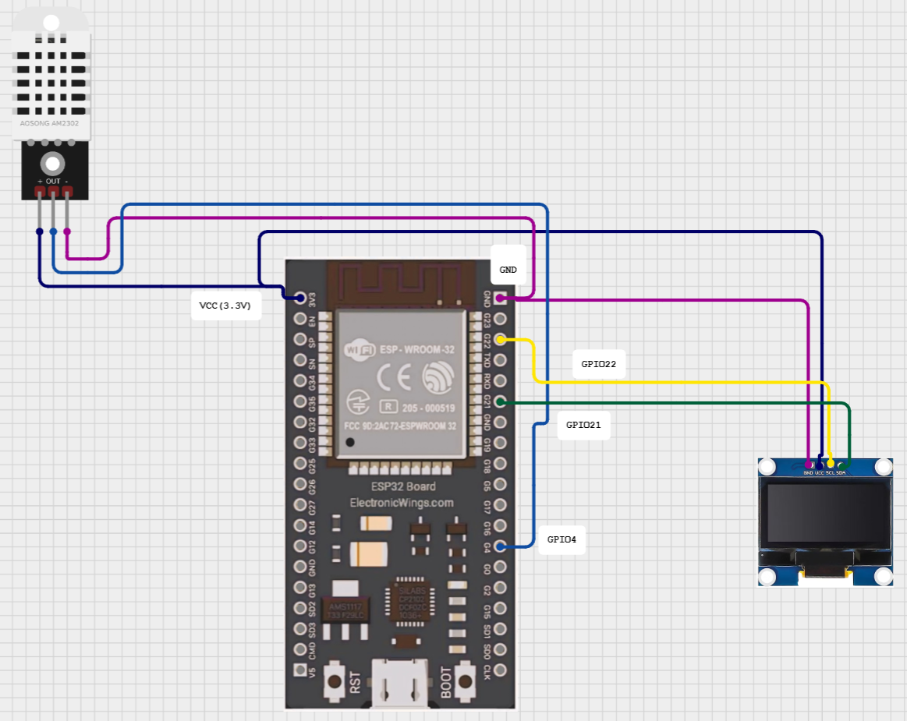

<div align="center">
  <h1>🌡️ ESP32 DHT22 OLED Display</h1>
  <p><i>Real-time temperature & humidity monitoring on an OLED screen</i></p>
  
  <br />
  
  <div>
    
    
    
    
    
  </div>
</div>

An **ESP32-based IoT project** that reads **temperature** 🌡️ and **humidity** 💧 from a **DHT22 sensor** and displays them in real-time on a crisp **0.96" OLED display** 📺.

---

## ✨ Features
- 📊 Real-time temperature & humidity readings.
- 🖥️ OLED display with clear text output.
- ⚡ Fast and accurate DHT22 sensor.
- 🔌 Simple wiring and lightweight code.

---

## 🛠️ Hardware Required
- **ESP32 Development Board**
- **DHT22 Temperature & Humidity Sensor**
- **0.96" OLED Display** (I2C)
- Jumper wires & breadboard

---

## 🔌 Wiring Diagram

| ESP32 Pin | OLED Pin | DHT22 Pin |
|-----------|----------|-----------|
| 3.3V      | VCC      | VCC       |
| GND       | GND      | GND       |
| GPIO22    | SCL      | —         |
| GPIO21    | SDA      | —         |
| GPIO4     | —        | Data      |

---

## 📜 Installation
1. **Clone this repository**  
   ```bash
   git clone https://github.com/yourusername/esp32-dht22-oled.git
   cd esp32-dht22-oled
   ```

2. **Install required Arduino libraries**
   - ***Adafruit SSD1306***
   - ***Adafruit GFX Library***
   - ***DHT Sensor Library***

3. **Upload to ESP32 using Arduino IDE or PlatformIO**  

---
## 📷 Demo
  - ***Wokwi Demo*** = https://wokwi.com/projects/439332029392918529
## <div></div>
## <div></div>
## <div></div>

---

## 📄 Sketch

## <div></div>

---

💡 Tip: You can expand this project by adding Wi-Fi logging, SD card storage, or IoT cloud integration.
